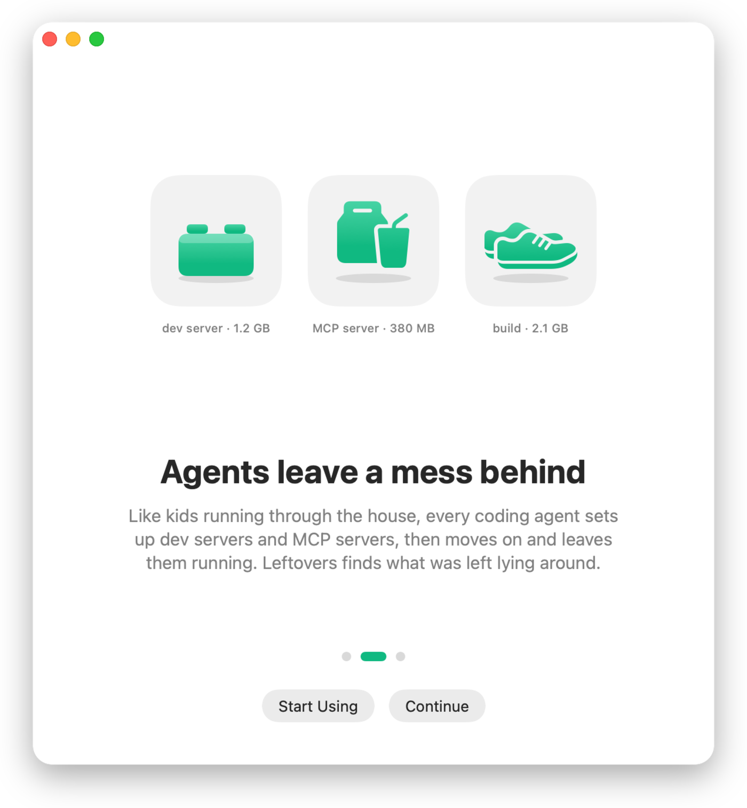
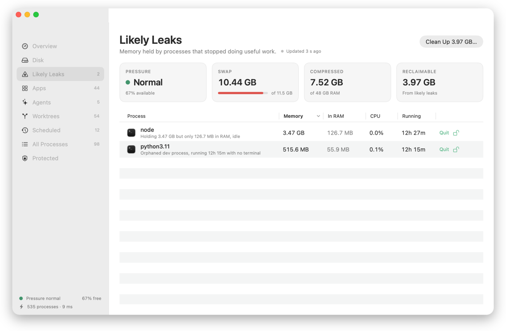
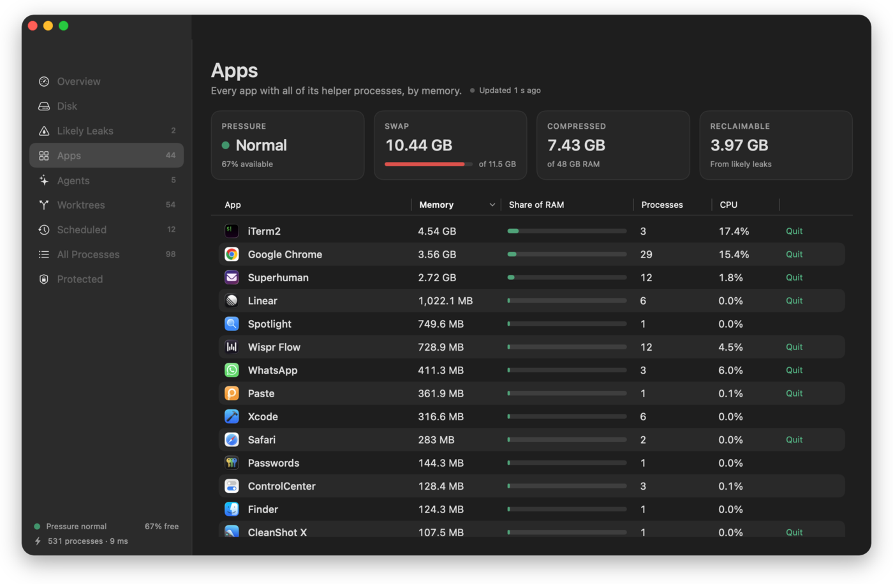

<p align="center">
  
</p>

<h1 align="center">Leftovers</h1>

<p align="center">
  Clean up what your apps and agents left running.<br>
  A free, open-source menu-bar app for macOS.
</p>

<p align="center">
  
</p>

---

## Why

Think of a house with kids running through it: each one grabs a plate, sets up at a
table, and runs off to the next thing. Coding agents work the same way. Each session
starts dev servers, builds and its own copy of every MCP server, then moves on and
leaves them running. The memory stays taken, swap fills up, and the Mac slows down.

Activity Monitor makes this hard to see. It sorts by memory in RAM, but a leak that has
been swapped out barely shows there. Leftovers reads each process's **footprint**:
RAM plus compressed plus swapped. That's the number macOS actually pays for.

> The case that started this project: a video-encoder helper showing **7 MB** in RAM
> while holding a **59 GB** footprint, idle for four days.

<p align="center">
  
</p>

## What it does

- **Menu bar**: a dial whose needle shows memory in use, and a standard macOS menu:
  memory and swap bars at the top, then likely leaks, the apps using the most memory,
  and your agents, each with its real logo.
- **Dashboard**: a sidebar window with five views.
  - **Likely Leaks**: each one with a plain-language reason and a Quit button.
  - **Apps**: every app with all of its helper processes summed, with the app's own icon.
  - **Agents**: memory per coding-agent session (Claude Code, Codex, Gemini CLI, Cursor
    Agent, Aider, OpenCode), including everything it started, and the tool (MCP) servers
    that several sessions each run their own copy of.
  - **All Processes** and **Protected**.
- **Clean Up**: quits every likely leak in one step, after a standard confirmation.
- **Fast**: the window and the first reading appear in well under a second, and
  every refresh shows how long it took ("812 processes · 41 ms").
- **Dock and menu bar**: a normal Dock app with a menu-bar dial. Hide the Dock icon
  in Settings to keep just the dial. ⌘Q closes the window and Leftovers keeps
  watching; **Quit Leftovers** in the menu quits completely.
- **Settings**: Dock icon, close behavior, open at login, updates, refresh interval,
  menu-bar display, and your protected apps.
- **Command line for agents**: the same engine and safety rules, as text or JSON.

App logos come from the apps installed on your Mac. Nothing is downloaded.

<p align="center">
  
  
</p>

## What counts as a leak

| Rule | Condition |
|---|---|
| Hoarding | Footprint ≥ 2 GB, at least 4× what is in RAM, idle, running ≥ 1 hour |
| Orphaned dev process | node / python / bun / deno… whose terminal or agent is gone, idle ≥ 12 hours |
| Folder deleted | A dev process whose working folder no longer exists (e.g. a removed git worktree) |
| Large while idle | Footprint ≥ 8 GB, idle, running ≥ 1 hour |

All thresholds live in [`Classification/Thresholds.swift`](Sources/Leftovers/Classification/Thresholds.swift).

## What it never touches

Protection is checked before any leak rule runs, so a protected process can't become a
candidate:

- anything owned by root or another user
- core macOS processes (WindowServer, Dock, Finder, Spotlight, loginwindow, and more)
- macOS binaries under `/System`, `/usr` and `/sbin`, with one exception: on-demand
  XPC helpers. launchd relaunches those when needed, so one may be quit only
  while it's hoarding.
- Leftovers itself, and anything you protect

Before signalling a process, it checks the process ID still belongs to the same process
(by start time). It asks the process to quit first and forces it only after 3 seconds.

## Install

**Download:** [Leftovers.dmg](../../releases/latest/download/Leftovers.dmg), open it and drag
Leftovers to Applications. Builds are signed with a Developer ID and notarized by Apple,
so they open without warnings.

**Homebrew:**

```sh
brew install --cask arpwal/tap/leftovers
```

Requires macOS 14 Sonoma or later, on Apple silicon or Intel. Website:
[arpwal.github.io/leftovers](https://arpwal.github.io/leftovers/).

## Command line

The app binary doubles as a CLI, so scripts and coding agents can use it:

```sh
mkdir -p ~/.local/bin
ln -s "/Applications/Leftovers.app/Contents/MacOS/Leftovers" ~/.local/bin/leftovers

leftovers --report   # human-readable summary
leftovers --json     # machine-readable report (stable field names)
leftovers --clean    # quit every likely leak; protected processes are refused
leftovers --check-updates   # updater state and a check against the live feed
```

An agent can run `leftovers --json`, read `likelyLeaks` and `duplicateToolServers`,
and decide what to do. It's the same data the app shows.

## Privacy

Leftovers collects nothing and has no telemetry. Its only network request is a daily update
check (Sparkle, against this repository's release feed), which you can turn off in Settings.
Everything it reads comes
from the kernel on your Mac, and nothing leaves it.

## Build from source

```sh
swift build                    # debug build
swift run Leftovers        # run the menu-bar app
scripts/bundle.sh              # universal release .app in build/
SIGNING_IDENTITY_OVERRIDE=- scripts/sign.sh   # ad-hoc sign for local use
scripts/install-local.sh       # copy to ~/Applications and launch
```

Maintainers: `scripts/release.sh` bumps the version (patch by default; pass `minor` or `major`), builds, notarizes and staples the app and DMG, publishes the GitHub release, updates the Homebrew tap and verifies the live download. Commits and tags are signed.
(configuration in [`packaging/release.env`](packaging/release.env)).

## Project layout

```
Sources/Leftovers/
  Sampling/        libproc + sysctl readers (footprint, CPU, argv, swap)
  Classification/  protection policy, leak rules, thresholds
  Agents/          agent-session attribution, duplicate tool servers
  Actions/         safe termination (identity check, TERM then KILL)
  Store/           sampling loop and app state
  UI/              menu-bar popover, dashboard, design tokens
  CLI/             --report, --json, --clean, --snapshot [--redact]
  Onboarding/      three-page welcome with its animations
design/            icon sources (SVG)
docs/              website (GitHub Pages) and README screenshots
packaging/         Info.plist, icon, release config
scripts/           bundle, sign, notarize, release
```

## Support

Leftovers is free and will stay free. If it helped, [star the repository](https://github.com/arpwal/leftovers)
so other people can find it, and follow [@arpwal on X](https://x.com/arpwal) for what's next.
Bug reports and pull requests are welcome.

## License

MIT © Arpit Agarwal
