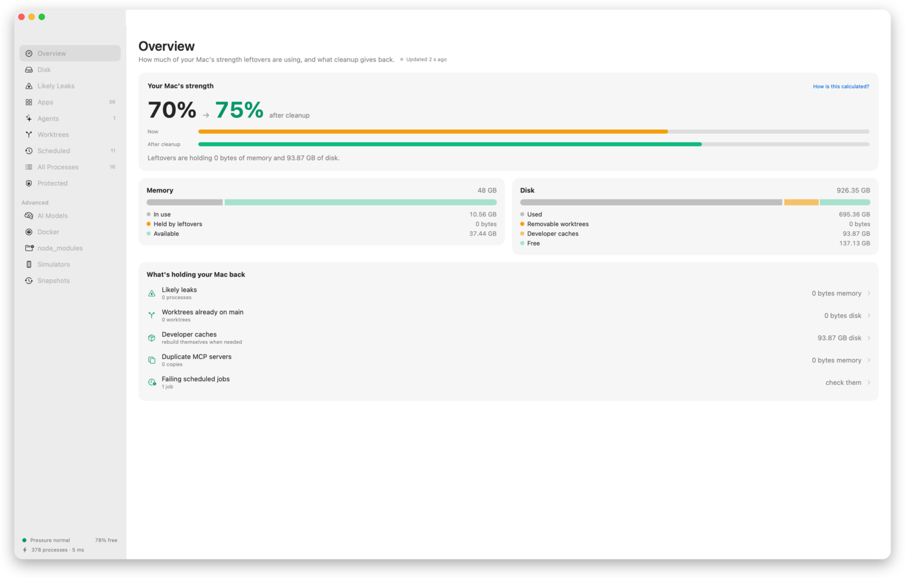
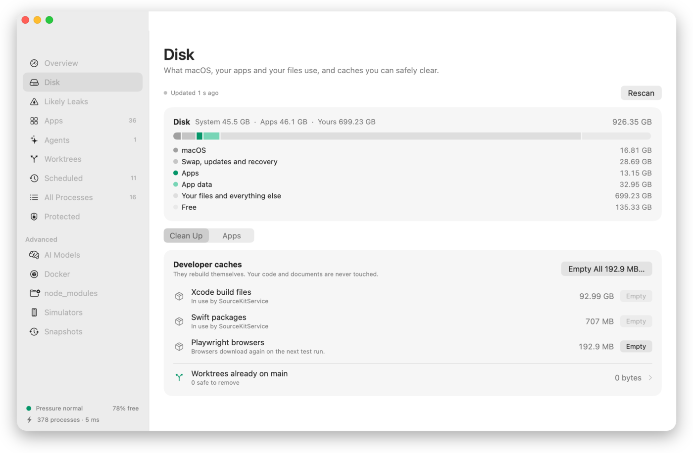
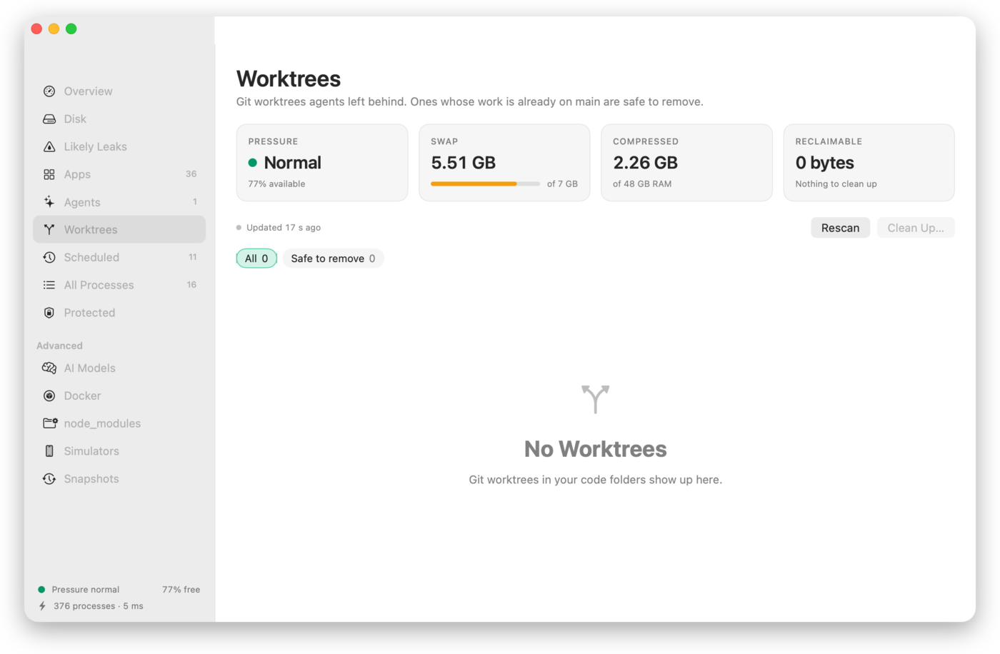
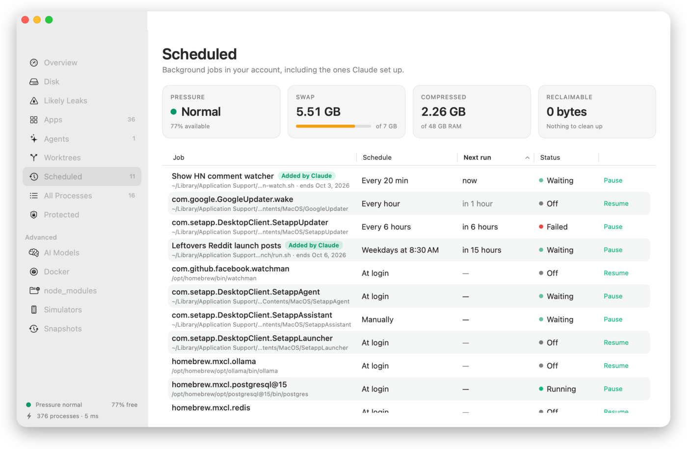

<p align="center">
  
</p>

<h1 align="center">Leftovers</h1>

<p align="center">
  Clean up what your apps and agents left running.<br>
  A free, open-source menu-bar app for macOS.
</p>

<p align="center">
  
</p>

---

## Why

Think of a house with kids running through it: each one grabs a plate, sets up at a
table, and runs off to the next thing. Coding agents work the same way. Each session
starts dev servers, builds and its own copy of every MCP server, then moves on and
leaves them running. The memory stays taken, swap fills up, and the Mac slows down.

Activity Monitor makes this hard to see. It sorts by memory in RAM, but a leak that has
been swapped out barely shows there. Leftovers reads each process's **footprint**:
RAM plus compressed plus swapped. That's the number macOS actually pays for.

> The case that started this project: a video-encoder helper showing **7 MB** in RAM
> while holding a **59 GB** footprint, idle for four days.

<p align="center">
  
</p>

## What it does

- **Menu bar**: a dial whose needle shows memory in use, and a standard macOS menu:
  memory and swap bars at the top, then likely leaks, the apps using the most memory,
  and your agents, each with its real logo.
- **Overview**: your Mac's strength now and after a safe cleanup (memory, swap and disk,
  with the formula shown), memory and disk bars, and what's holding it back.
- **Dashboard**: a sidebar window with these views.
  - **Disk**: your disk split into **System** (macOS, swap, updates, recovery), **Apps**
    (the apps you installed plus their support data and caches, per app, sortable) and
    **Yours**. Empties developer caches that rebuild themselves (Xcode build files,
    simulator caches, npm, pnpm, Yarn, Bun, pip, uv, Poetry, Homebrew, SwiftPM, CocoaPods,
    Gradle, Go, Cargo, Playwright), each only while nothing using it runs, and clears an
    app's caches while it's quit. Your code and documents are never touched. Opens
    instantly from the last scan and re-measures in the background.
  - **Advanced** (scanned only when you open them):
    - **AI Models**: Ollama, Hugging Face and LM Studio downloads. Removing an Ollama
      model keeps the parts another model shares.
    - **Docker**: unused images, stopped containers and build cache. Volumes are never
      offered: they can hold databases.
    - **node_modules**: every project's installed packages with when they were last
      installed. Projects something is working in are kept.
    - **Simulators**: simulators whose iOS version is gone, and runtimes no simulator uses.
    - **Snapshots**: local Time Machine snapshots (macOS asks for your password) and
      purgeable space.
  - **Low-disk warning**: one notification a day when under 10% free (can be turned off).
  - **Likely Leaks**: each one with a plain-language reason and a Quit button.
  - **Apps**: every app with all of its helper processes summed, with the app's own icon.
  - **Agents**: memory per coding-agent session (Claude Code, Codex, Gemini CLI, Cursor
    Agent, Aider, OpenCode), including everything it started, and the tool (MCP) servers
    that several sessions each run their own copy of.
  - **Worktrees**: git worktrees across your code folders. Ones whose work is already
    on main, including branches **squash-merged** on GitHub (which `git branch --merged`
    can't see), with no uncommitted changes and nothing working in them, are safe to
    remove, one at a time or all at once. Chips show how many are safe, have changes,
    are in use or aren't on main yet, and always add up. The check is read-only: git
    refuses to remove anything with uncommitted work, and branches are kept.
  - **Every table sorts** by any column, and the last reading's age ticks live.
  - **Scheduled**: every background job (LaunchAgent) in your account, with a readable
    schedule, next run, and whether it's running, waiting, off or failing. Run now,
    pause, resume, view its log, or move it to the Trash. Jobs that agents created are
    labelled, with what they're for and when they end.
  - **All Processes** and **Protected**.
- **Clean Up**: quits every likely leak in one step, after a standard confirmation.
- **Fast**: the window and the first reading appear in well under a second, and
  every refresh shows how long it took ("812 processes · 41 ms").
- **Dock and menu bar**: a normal Dock app with a menu-bar dial. Hide the Dock icon
  in Settings to keep just the dial. ⌘Q closes the window and Leftovers keeps
  watching; **Quit Leftovers** in the menu quits completely.
- **Settings**: Dock icon, close behavior, open at login, updates (with a notification
  when one is ready), refresh interval, menu-bar display, and your protected apps.
- **What's new**: every release has short, plain notes in [CHANGELOG.md](CHANGELOG.md),
  written by Claude from the release's changes.
- **Command line for agents**: the same engine and safety rules, as text or JSON.

App logos come from the apps installed on your Mac. Nothing is downloaded.

<p align="center">
  
</p>
<p align="center">
  
</p>

<p align="center">
  
  
</p>

<p align="center">
  
  
</p>

### For agents that create background jobs

If your agent sets up a LaunchAgent, leave a note beside it so people can see what
it's for. Write `~/Library/Application Support/Leftovers/jobs/<label>.json`:

```json
{"purpose": "Nightly backup check", "createdBy": "Claude (Claude Code)",
 "createdAt": "2026-09-26T23:00:00Z", "endsOn": "2026-10-31T23:59:00Z"}
```

Leftovers shows the purpose as the job's name, tags it with who created it, and shows
when it ends.

## What counts as a leak

| Rule | Condition |
|---|---|
| Hoarding | Footprint ≥ 2 GB, at least 4× what is in RAM, idle, running ≥ 1 hour |
| Orphaned dev process | node / python / bun / deno… whose terminal or agent is gone, idle ≥ 12 hours |
| Folder deleted | A dev process whose working folder no longer exists (e.g. a removed git worktree) |
| Large while idle | Footprint ≥ 8 GB, idle, running ≥ 1 hour |

All thresholds live in [`Classification/Thresholds.swift`](Sources/Leftovers/Classification/Thresholds.swift).

## What it never touches

Protection is checked before any leak rule runs, so a protected process can't become a
candidate:

- anything owned by root or another user
- core macOS processes (WindowServer, Dock, Finder, Spotlight, loginwindow, and more)
- macOS binaries under `/System`, `/usr` and `/sbin`, with one exception: on-demand
  XPC helpers. launchd relaunches those when needed, so one may be quit only
  while it's hoarding.
- Leftovers itself, and anything you protect

Before signalling a process, it checks the process ID still belongs to the same process
(by start time). It asks the process to quit first and forces it only after 3 seconds.

## Install

**Download:** [Leftovers.dmg](../../releases/latest/download/Leftovers.dmg), open it and drag
Leftovers to Applications. Builds are signed with a Developer ID and notarized by Apple,
so they open without warnings.

**Homebrew:**

```sh
brew install --cask arpwal/tap/leftovers
```

Requires macOS 14 Sonoma or later, on Apple silicon or Intel. Website:
[arpwal.github.io/leftovers](https://arpwal.github.io/leftovers/).

## Command line

The app binary doubles as a CLI, so scripts and coding agents can use it:

```sh
mkdir -p ~/.local/bin
ln -s "/Applications/Leftovers.app/Contents/MacOS/Leftovers" ~/.local/bin/leftovers

leftovers --report   # human-readable summary
leftovers --json     # machine-readable report (stable field names)
leftovers --clean    # quit every likely leak; protected processes are refused
leftovers --check-updates   # updater state and a check against the live feed
leftovers --jobs     # scheduled background jobs (add --json for agents)
leftovers --worktrees   # git worktrees and which are safe to remove (add --json)
leftovers --disk        # system, apps and yours, plus developer caches (add --json)
leftovers --help     # every command
```

An agent can run `leftovers --json`, read `likelyLeaks` and `duplicateToolServers`,
and decide what to do. It's the same data the app shows.

## Privacy

Leftovers collects nothing and has no telemetry. Its only network request is a daily update
check (Sparkle, against this repository's release feed), which you can turn off in Settings.
Everything it reads comes
from the kernel on your Mac, and nothing leaves it.

## Build from source

```sh
swift build                    # debug build
swift run Leftovers        # run the menu-bar app
scripts/bundle.sh              # universal release .app in build/
SIGNING_IDENTITY_OVERRIDE=- scripts/sign.sh   # ad-hoc sign for local use
scripts/install-local.sh       # install (one copy only) and launch
swift test                     # unit tests, plus integration tests against real git
```

Maintainers: `scripts/release.sh` bumps the version (patch by default; pass `minor` or `major`), builds, notarizes and staples the app and DMG, publishes the GitHub release, updates the Homebrew tap and verifies the live download. Commits and tags are signed.
(configuration in [`packaging/release.env`](packaging/release.env)).

## Project layout

```
Sources/Leftovers/
  Sampling/        libproc + sysctl readers (footprint, CPU, argv, swap)
  Classification/  protection policy, leak rules, thresholds
  Agents/          agent-session attribution, duplicate tool servers
  Actions/         safe termination (identity check, TERM then KILL)
  Store/           sampling loop and app state
  UI/              menu-bar popover, dashboard, design tokens
  CLI/             --report, --json, --clean, --snapshot [--redact]
  Onboarding/      three-page welcome with its animations
design/            icon sources (SVG)
docs/              website (GitHub Pages) and README screenshots
packaging/         Info.plist, icon, release config
scripts/           bundle, sign, notarize, release
```

## Support

Leftovers is free and will stay free. If it helped, [star the repository](https://github.com/arpwal/leftovers)
so other people can find it, and follow [@arpwal on X](https://x.com/arpwal) for what's next.
Bug reports and pull requests are welcome.

## License

MIT © Arpit Agarwal
